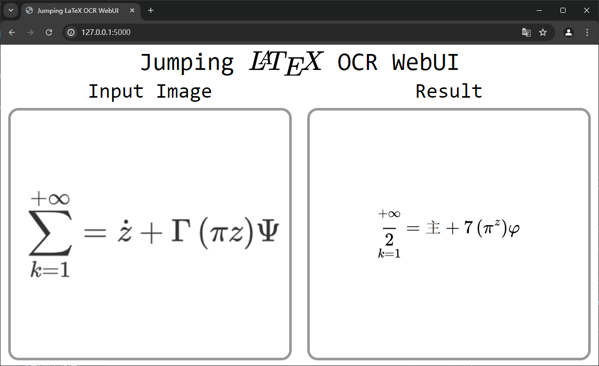

# Jumping LaTeX OCR WebUI

姜氏数学公式解析器

姜圣在2024阿赛初赛中获得12名的好成绩，这需要归功于她独创的一套数学体系——姜氏数学。

该套数学体系十分完备，原创了许多独特的数学符号，包含了谢惠民数学方便面相关的芝士。

姜圣擅长 $\LaTeX$，本项目就是协助姜圣将日常的普通数学公式转化为她原创的姜氏数学公式。

## 姜氏数学简介

数学符号方面的改进：

1. $\sum$ 改为 $\mathop{\frac{}2}$。此修改依据著名的姜萍恒等式 $\displaystyle\sum_{k=0}^{+\infty} = \displaystyle\mathop{\frac{}2}\limits_{k=0}^{+\infty}$。
2. $\dot z$、 $\dot{\mathcal{Z}}$ 改为 $主$。此修改用以表示姜氏数学使用者心中始终保持对主的虔诚，等待主从三体星系降临到地球上。
3. $\Gamma$ 改为 $7$ 或 $T$。
4. $\pi z$ 改为 $\pi^z$。此修改为姜圣在黑板上所写下的谶语，虽然不知道是啥意思，但是写就完事了。
5. $\phi$、 $\Phi$、 $\varPhi$、 $\psi$、 $\Psi$ 改为 $\varphi$。此修改是因为姜圣分不清楚这些符号的区别，作为姜氏数学的使用者，分不清楚这些符号才能更好的做题。
6. $c\mu$ 改为 $L/\text -l$。【[出处](https://www.zhihu.com/question/659498117/answer/3538824153)】
7. $\mu$ 改为 $m$ 或 $ru$。【[出处](https://www.zhihu.com/question/659498117/answer/3538824153)】
8. $\nabla$ 改为 $D$。
9. $B_1$ 改为 $B \cdot 1$。


读音方面的改进：

1. “数学分析”应读作“数学方面”


## 安装

请先确保您电脑上已安装 Pytorch，再运行以下命令：

```bash
pip install -r requirements.txt
```

## 使用

运行命令：

```bash
python app.py
```

等待程序启动完毕，出现 `* Running on http://127.0.0.1:5000 INFO:werkzeug:Press CTRL+C to quit` 字样，打开 `localhost:5000` 即可使用 Jumping LaTeX OCR WebUI。


界面为英语，因为姜圣能看懂英文原版数学方面著作。如果使用者不如姜圣英语那么好，看不懂界面内容，也可以通过查阅《英汉小词典》读懂。


按照提示 drag and drop or click 上传 $\LaTeX$ 截图后，等待片刻，转换好的姜氏数学公式就会出现在 Result 窗口中。




## 姜学学习心得摘录

[@秋分丿](https://www.zhihu.com/people/wang-huang-xuan)【[出处](https://www.zhihu.com/question/659498117/answer/3538824153)】：姜圣的书写内容犹如克苏鲁，不可直视，不可解读，任何主观的解读都是在曲解姜圣的公式。

[@源律花](https://www.zhihu.com/people/86011a3be26da90a252e9263dd98e633)：信他的人，不被定罪；不信的人，罪已经定了。甚至将祂的独生女赐给他们。叫一切信祂的不致灭亡，反得永生。

[@ArrogantGao](https://github.com/ArrogantGao) $\LaTeX$ 大佬提出：在 $\LaTeX$ 中加入如下宏即可实现姜氏数学公式的转换【[#4](https://github.com/Howardzhangdqs/jumping-latex-ocr/issues/4)】

```latex
\renewcommand{\Gamma}{7}
\renewcommand{\Psi}{\varphi}
\newcommand{\piz}{\pi^z}
\renewcommand{\sum}{\frac{~}{2}}
```

[@HellOwhatAs](https://github.com/HellOwhatAs) Typst 大佬编写了以下代码，实现了姜氏数学的10大基础规则的转换【[#6](https://github.com/Howardzhangdqs/jumping-latex-ocr/issues/6)】：

```typst
#let jumping(doc) = {
  import "@preview/quick-maths:0.1.0": shorthands
  show math.attach.where(
    base: text(math.sum)
  ).or(
    math.attach.where(base: text(math.Sigma))
  ): it => {
    math.attach(
      math.limits(math.frac(it.t, "2")),
      b: it.b, bl: it.bl, br: it.br, tl: it.tl, tr: it.tr
    )
  }
  show math.sum: math.frac("", "2")
  show math.Sigma: math.frac("", "2")
  show math.accent.where(base: [z], accent: "\u{307}").or(
    math.accent.where(base: math.cal("Z"), accent: "\u{307}")
  ): "主"
  show math.Gamma: "7"
  show math.phi.alt: math.phi
  show math.Phi: math.phi
  show math.psi: math.phi
  show math.Psi: math.phi
  show: shorthands.with(
    ($pi z$, $pi^z$),
    ($c mu$, $L "/" -l$),
  )
  show math.mu: "m"
  show math.nabla: "D"
  show math.attach.where(base: [B], b: [1]): $B dot.c 1$
  show "数学分析": "数学方面"
  doc
}
/* 以上是 jumping 函数定义 */

#set text(lang: "zh")
#let test = $ sum_(k = 1)^(+ oo) =  dot(z) +  Gamma (pi  z) Psi $

// 原式
#test

// 转换
#jumping(test)

// 应用于余下整个文档
#show: jumping

数学分析，我们喜欢你
```

效果如下：


